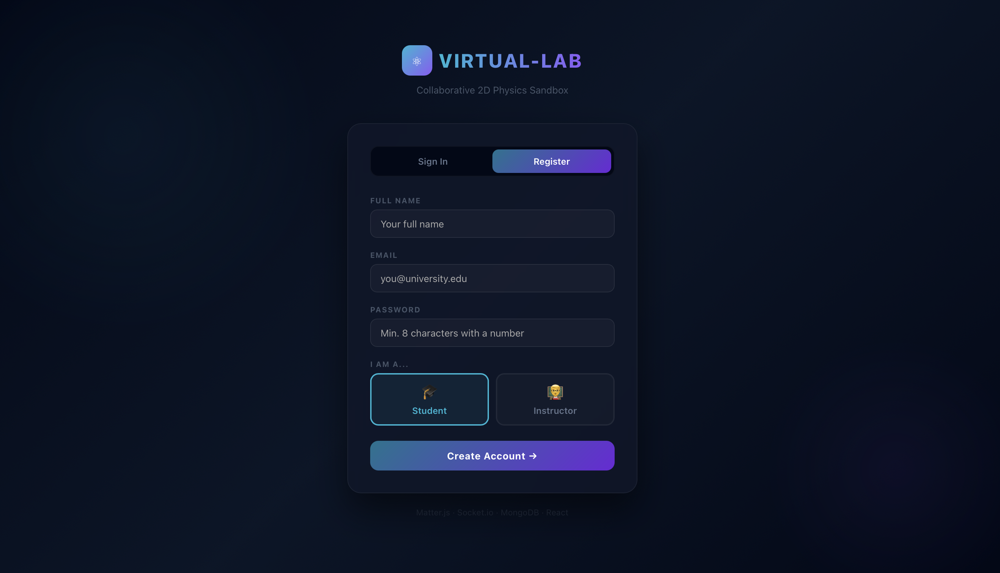
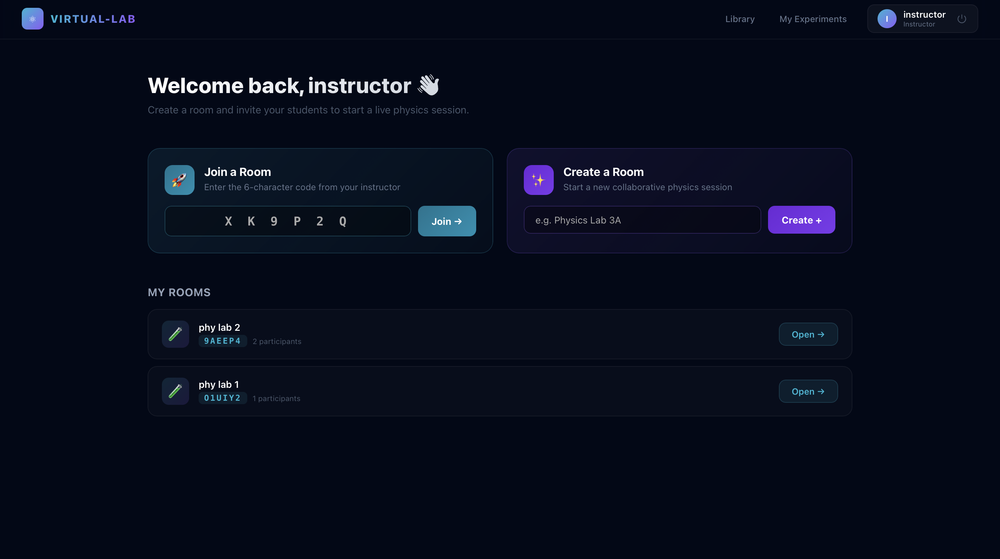
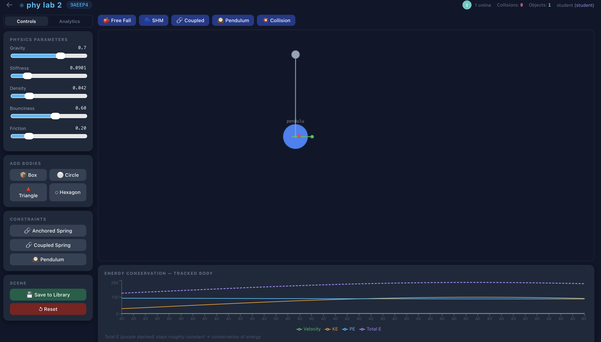
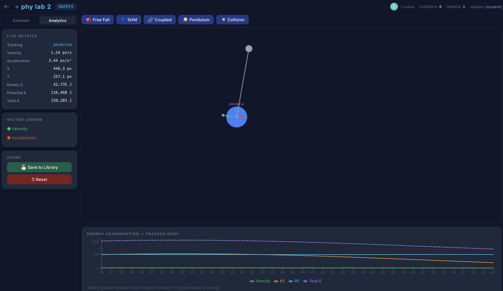

# VIRTUAL-LAB ⚛️

> A real-time collaborative 2D physics sandbox built for university-level STEM education.
> Multiple users build, run, and analyse mechanical simulations together in a shared workspace —
> think Google Docs, but for physics experiments.

[](https://github.com/eshikakatekhaye/virtual-lab/actions)
[](LICENSE)
[](docker-compose.yml)
[](backend/package.json)

---

## Demo

> 📹 **[Watch Demo Video](#)**


---

## Screenshots

### Login & Registration

*Role-based registration — students and instructors get different dashboards and permissions.*

### Instructor Dashboard

*Instructors can create rooms, share a 6-character join code, and manage all their active sessions.*

### Physics Canvas — Controls View

*Live 2D physics simulation powered by Matter.js. Green arrows show velocity vectors, red arrows show acceleration. The energy conservation graph updates in real time at the bottom.*

### Physics Canvas — Analytics View

*The analytics tab shows live kinetic energy, potential energy, position, velocity, and acceleration for any tracked body. The purple dashed line (Total E) stays roughly flat — visually proving the law of conservation of energy.*

---

## The Problem

Teaching physics online is frustrating. Students watch static videos, read equations off a screen, and never actually *feel* how a pendulum behaves differently when you change its length, or what happens to coupled springs when you crank up the stiffness. The gap between theory and intuition is hard to bridge without hands-on experimentation.

VIRTUAL-LAB addresses this by giving instructors and students a shared, live physics canvas where they can build experiments together and watch the math play out in real time. An instructor can set up a pendulum, ask students to predict what will happen when gravity doubles, then flip it live while everyone watches their predictions get tested.

---

## Features

### For Students
- Join any live room using a 6-character code shared by the instructor
- Add physics bodies to the shared canvas — boxes, circles, triangles, hexagons
- See **live velocity and acceleration vectors** drawn directly on each body
- Track any body and watch its **kinetic energy, potential energy, and total energy** update on a live Recharts graph
- Observe **conservation of energy** visually — total energy stays flat as KE and PE trade off
- Save experiments to a personal library for later review
- Browse the experiment library and clone published templates

### For Instructors
- Create a named room and share the join code with your class
- Load preset experiments instantly: **Free Fall, SHM, Coupled Springs, Pendulum, Collision**
- **Lock the room** so students can only observe while you demonstrate — all edit controls grey out on their end
- Trigger **Chaos Events** that broadcast to every student simultaneously:
  -  **Flip Gravity** — inverts gravity; great for demonstrating gravitational potential energy
  -  **Shockwave** — applies an outward impulse from canvas centre; demonstrates impulse and momentum
  -  **Freeze All** — stops every body mid-motion; pause a demo to discuss what's happening at that exact frame
  -  **Zero Gravity** — removes gravity entirely for orbital mechanics demonstrations
  -  **Pin Mode** — click any body to anchor it in place; build custom constraint setups
- Publish experiments as templates with student instructions and a grading rubric
- Review and grade student submissions

---

## How Real-Time Sync Works

This was the hardest engineering problem in the project. When the instructor adds a pendulum, every student sees it appear at the exact same position. When the instructor drags a body, every student sees it move smoothly.

**The challenge:** Matter.js generates random positions for new bodies using `Math.random()`. If each client calls this independently, bodies appear at different positions on different screens.

**The fix:** The sender generates the random position *once*, applies it locally, then emits `canvas_action` with the explicit `x, y` coordinates. Receiving clients use those exact coordinates instead of generating their own.

```
Instructor adds body:
  1. Generate x = Math.random() * 600 + 180
  2. Apply locally to own Matter.js world
  3. Emit { action: "add_body", type: "circle", x: 423, y: 80 }

Server receives:
  4. Rebroadcast to all other sockets in the room

Student receives:
  5. Apply body at exactly x: 423, y: 80
  → Both canvases are identical
```

**Drag sync:** Position updates fire on every `mousemove` while dragging. The server skips the MongoDB lookup for these events entirely and rebroadcasts immediately — otherwise at 60fps you would fire thousands of DB queries per second.

**The subtle React bug:** The Socket.io client connects asynchronously. The original code stored the socket in a `useRef` and passed `socketRef.current` to React context — which was `null` at render time and never triggered a re-render when it connected. The fix was storing the socket in `useState` so components re-render when the connection becomes live.

---

## Tech Stack

| Layer | Technology | Reason |
|---|---|---|
| Frontend | React 18 + Hooks | Component model, Context API for global state |
| Physics | Matter.js | Best 2D rigid body engine available for browsers |
| Real-time | Socket.io | WebSocket with automatic fallback, rooms built-in |
| Charts | Recharts | React-native, handles continuous streaming data |
| Backend | Node.js + Express | Non-blocking I/O, ideal for socket-heavy servers |
| Database | MongoDB + Mongoose | Flexible JSON schema suits physics state storage |
| Auth | JWT + bcrypt | Stateless, horizontally scalable, no session store |
| DevOps | Docker + GitHub Actions | Reproducible builds, automated CI on every PR |

---

## Architecture

```
Browser (React)
  │
  ├── AuthContext        → REST calls via axios (login, register, experiments)
  │     └── JWT stored in localStorage, attached to every request via interceptor
  │
  ├── SocketContext      → Single Socket.io connection per session
  │     └── Stored in useState (not useRef) so components re-render on connect
  │
  └── PhysicsCanvas
        ├── Matter.js Engine  → full 2D physics simulation (gravity, collisions,
        │                        constraints, restitution, friction)
        ├── canvas_action     → emits on every user interaction with explicit coords
        ├── move_body         → emits on mousemove during drag (bypasses DB)
        └── Recharts          → plots KE, PE, Velocity, Total E in real time

        ↕  WebSocket (Socket.io)

Node.js Server
  ├── Express REST API
  │     /api/auth          → JWT register / login / me
  │     /api/rooms         → create, join by code, lock/unlock, state persistence
  │     /api/experiments   → save, version, publish, clone, submit, grade
  │     /api/analytics     → fetch timeseries log for a room
  │
  └── Socket.io Manager
        join_room          → authenticate, send physicsState snapshot to new joiner
        canvas_action      → rebroadcast add/preset/reset with coords to others
        move_body          → rebroadcast drag position instantly (no DB hit)
        chaos_event        → instructor-only, broadcast to all users in room
        toggle_lock        → lock/unlock room, update DB, broadcast state change
        cursor_move        → broadcast cursor position (presence indicators)

        ↕  Mongoose ODM

MongoDB
  ├── Users       → bcrypt-hashed passwords, RBAC roles (student/instructor/admin)
  ├── Rooms       → physicsState snapshot, participant list, 24h TTL auto-expiry
  └── Experiments → versioned saves, submissions array, grades, publish status
```

---

## Running Locally

### Option A — Docker (recommended, one command)

Make sure Docker Desktop is open first — look for the whale icon 🐳 in your menu bar.

```bash
# 1. Clone the repo
git clone https://github.com/Tink-435/Virtual-lab.git
cd virtual-lab

# 2. Create environment file
cp backend/.env.example backend/.env
# Open backend/.env and set JWT_SECRET to any random string
# Example: JWT_SECRET=supersecretkey123456789

# 3. Start the full stack
docker-compose up --build
```

| Service | URL |
|---|---|
| Frontend | http://localhost:3001 |
| Backend API | http://localhost:5001 |
| Health Check | http://localhost:5001/health |

To stop: `Ctrl+C` then `docker-compose down`

---

### Option B — Manual Setup

Requires Node.js 18+ and MongoDB installed locally.

**Terminal 1 — MongoDB**
```bash
mongod
```

**Terminal 2 — Backend**
```bash
cd backend
cp .env.example .env
# Set JWT_SECRET in .env
npm install
npm run dev
# → http://localhost:5000
```

**Terminal 3 — Frontend**
```bash
cd frontend
npm install
npm start
# → http://localhost:3000
```

---

### First Run Walkthrough

1. Go to `http://localhost:3001` — you'll see the login screen
2. Click **Register** → create an **Instructor** account
3. Open an **incognito window** → register a **Student** account
4. **Instructor window:** click **Create Room**, give it a name, copy the 6-char code
5. **Student window:** paste the code into **Join a Room**, click Join
6. Both users are now live in the same physics canvas

**Try this to see real-time sync:**
- Instructor: click the **Pendulum** preset → student sees the pendulum appear instantly
- Instructor: drag the pendulum bob → student sees it move in real time
- Instructor: click **Flip Gravity** from the Instructor Controls panel → both canvases invert simultaneously
- Instructor: click **Lock Room** → all student controls grey out immediately

---

## Running Tests

```bash
cd backend
npm test                    # run all tests
npm test -- --coverage      # with coverage report
```

**Test coverage includes:**
- OT conflict resolution engine — 9 unit tests covering fast path, conflict resolution, idempotency, and state mutation safety
- Auth routes — 8 integration tests against an in-memory MongoDB instance covering registration validation, login, JWT verification, and role enforcement

---

## Project Structure

```
virtual-lab/
├── .github/
│   └── workflows/ci.yml        → GitHub Actions: lint → test → docker build
├── docker-compose.yml           → one-command full stack (mongo + backend + frontend)
├── screenshots/                 → README screenshots
│
├── backend/
│   ├── src/
│   │   ├── server.js            → Express + Socket.io entry point
│   │   ├── config/db.js         → MongoDB connection with retry logic
│   │   ├── middleware/
│   │   │   └── auth.js          → JWT protect middleware + RBAC authorize
│   │   ├── models/
│   │   │   ├── User.js          → bcrypt pre-save hook, toPublicJSON, comparePassword
│   │   │   ├── Room.js          → physicsState schema, TTL index, participant tracking
│   │   │   └── Experiment.js    → versioning array, submissions subdocs, publish flow
│   │   ├── controllers/         → authController, roomController, experimentController
│   │   ├── routes/              → auth, rooms, experiments, analytics
│   │   └── socket/
│   │       ├── socketManager.js → all Socket.io event handling
│   │       └── otEngine.js      → Operational Transformation conflict resolution
│   ├── __tests__/
│   │   ├── otEngine.test.js     → OT unit tests
│   │   └── auth.test.js         → auth integration tests
│   └── Dockerfile               → multi-stage build, non-root user
│
└── frontend/
    ├── src/
    │   ├── context/
    │   │   ├── AuthContext.jsx  → global auth state, axios instance + interceptors
    │   │   └── SocketContext.jsx → socket stored in useState for reactive updates
    │   ├── components/
    │   │   ├── Canvas/
    │   │   │   └── PhysicsCanvas.jsx → Matter.js setup, drag sync, chaos events
    │   │   ├── Auth/AuthPage.jsx
    │   │   └── Library/ExperimentLibrary.jsx
    │   └── pages/
    │       ├── Dashboard.jsx    → role-aware (instructor vs student views)
    │       ├── RoomPage.jsx     → REST load → socket join sequence
    │       └── MyExperiments.jsx → versioning UI, grading panel
    └── Dockerfile               → multi-stage: CRA build → nginx serve
```

---

## Engineering Decisions & What I Learned

**Real-time sync is harder than it looks.**
The trickiest bug was that `socketRef.current` was `null` at component render time because the Socket.io connection is asynchronous. Components read the ref snapshot and never re-rendered when the connection became live. Switching from `useRef` to `useState` for the socket instance meant React re-rendered the component tree the moment the connection was ready — exactly when socket listeners needed to be registered.

**Physics engines don't care about your React lifecycle.**
Matter.js event handlers (like `mousemove` inside a `MouseConstraint`) are registered once in a `useEffect([], [])` and never re-run. Any React state or ref they close over is permanently stale after the first render. The solution was a module-level variable (`let _socketInstance = null`) that lives outside React's lifecycle entirely and is always current.

**Random positions break multi-user determinism.**
When adding a body with `Matter.Bodies.circle(Math.random() * 600, ...)`, each client generates a different random number. The fix sounds obvious in hindsight — generate the position once on the sender, include it in the socket payload, and have all receivers use that exact coordinate. Now all canvases are pixel-perfect identical.

**DB queries at 60fps will destroy your server.**
Drag sync fires a `move_body` event on every `mousemove`. With 10 users dragging simultaneously that's potentially 600 events per second. The socket handler for `move_body` skips `await Room.findOne()` entirely and just rebroadcasts. For add/preset/reset events that modify persistent state, the DB write is worth it. For ephemeral position updates, it is not.

**JWT in localStorage vs httpOnly cookies.**
The current implementation stores JWT in `localStorage` for simplicity. This is vulnerable to XSS — a malicious script on the page could steal the token. The production-hardened approach is `httpOnly` cookies, which are inaccessible to JavaScript. The tradeoff is that cookies require explicit CORS configuration and CSRF protection. Mentioned here because it always comes up in security-focused interviews.

---

## Known Limitations & Future Work

- [ ] If two users drag the same body simultaneously, last write wins — no conflict resolution for continuous drag events
- [ ] Physics is not fully deterministic across clients — floating point differences accumulate over long sessions
- [ ] No mobile/touch support on the canvas
- [ ] Experiment Library search requires a MongoDB text index (`db.experiments.createIndex({ title: "text", description: "text" })`) to be created manually on first run
- [ ] Would love to add a session **replay system** — record every canvas action with timestamps and play back the full experiment
- [ ] **LTI integration** to connect directly with Moodle or Canvas LMS for grade passback

---

## Deliverables Completed

| Deliverable | Status |
|---|---|
| Interactive Physics Canvas — drag, drop, configure bodies | ✅ |
| Multi-User Room Engine — real-time sync via Socket.io | ✅ |
| Physics Accuracy & Constraint System — springs, pendulum, pivot | ✅ |
| Real-Time Analytics Dashboard — KE, PE, velocity, force vectors | ✅ |
| Experiment Library — browse, clone, publish templates | ✅ |
| Agent Middleware — canvas_action sync, move_body delta broadcast | ✅ |
| JWT Auth + RBAC — student / instructor / admin roles | ✅ |
| Docker + CI/CD — one-command setup, GitHub Actions pipeline | ✅ |

---

*Built with Matter.js · Socket.io · React 18 · Node.js · MongoDB · Docker*